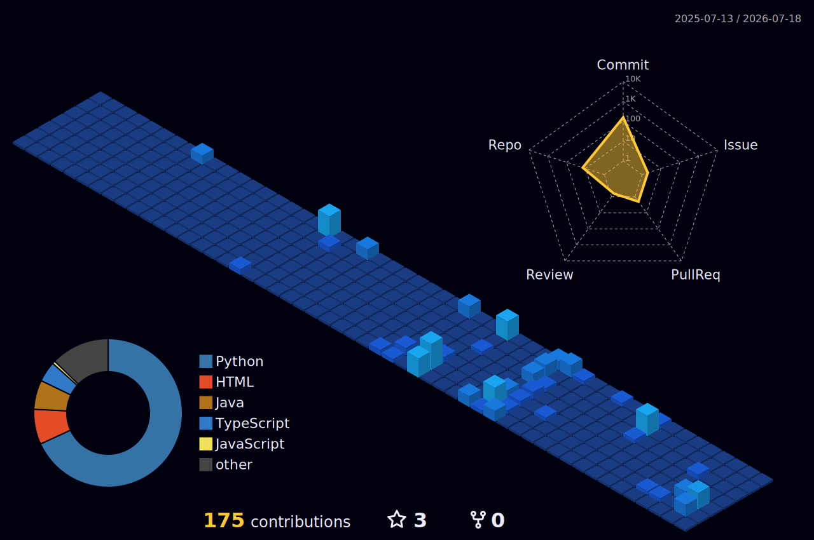

<div align="center">

<!-- Custom Header Banner with Twinkling Nebula Gradient -->


</div>

<p align="center">
  
</p>

<p align="center">
  
  
  
</p>

<p align="center">
  
</p>

---

## 📡 **Mission Control (About Me)**


```bash
sanjanamandal@deep-space-telemetry:~$ init --orbit-path
```

```yaml
astrometrics:
  operator: Sanjana Mandal
  station: Kolkata, India (Sector 3)
  education: B.Tech CSE (AI & ML) @ VIT Bhopal
  
flight_objectives:
  - Deep Learning & Astrophysical Vision
  - Convolutional Systems (CV) & Transformers
  - Dynamic Telemetry Pipelines (MLOps)
  
active_missions:
  - Optimizing Neural Computations
  - Multi-threaded Distributed Pipelines
  - Cosmic Pattern Analysis (DSA)
  
fun_fact: "I believe AI can navigate humanity through the cosmos 🚀"
```

<br clear="right"/>

<details>
<summary><b>🛰️ Payload Logs & Trajectory Details</b></summary>
<br>

🔭 **Scientific Directives:**
- Engineering scalable architectures to decipher cosmic & image datasets.
- Processing payload data with clean, automated telemetry feeds.
- Building distributed, failsafe software modules designed for future horizons.

</details>

---

## 🛠️ **Cargo Hold (Tech Stack)**

<p align="center">
  <a href="https://skillicons.dev">
    
  </a>
</p>

---

## 🚀 **Featured Projects**

<div align="center">

<table>
<tr>
<td width="50%">

### 🤖 **J.A.R.V.I.S**
*Cosmic Knowledge Retrieval*

<p align="left">
RAG-based cognitive pipeline to ingest, index, and query structural databases using large-scale semantic vector maps.
</p>

`Python` `NLP` `RAG` `VectorDB`

[**Establish Comms 📡**](https://github.com/sanjanamandal1)

</td>
<td width="50%">

### 📊 **ChurnSight**
*Trajectory Deviation Prediction*

<p align="left">
Machine learning architecture designed to isolate customer churn velocity using SHAP explainers for precise forecasting.
</p>

`Python` `SHAP` `Streamlit` `Scikit-Learn`

[**Establish Comms 📡**](https://github.com/sanjanamandal1)

</td>
</tr>
<tr>
<td width="50%">

### ✋ **Gesture Control System**
*Dynamic Interface Command*

<p align="left">
Computer vision module capturing high-frequency human coordinates to run spatial gestures dynamically.
</p>

`OpenCV` `MediaPipe` `Python`

[**Establish Comms 📡**](https://github.com/sanjanamandal1)

</td>
<td width="50%">

### 🛰️ **Deep Space Vision Pipeline**
*Planetary Object Classifier*

<p align="left">
Active research modules covering satellite imagery classification, custom MLOps scaling, and model hosting.
</p>

`MLOps` `Docker` `PyTorch`

**Awaiting Initialization...** ⭐

</td>
</tr>
</table>

</div>

---

## 🗺️ **Orbital Track (Git Activity Snake)**

<div align="center">
  <!-- Dynamic grid-eating snake compiled from activity telemetry -->
  
</div>

---

## 📊 **Telemetry & Galactic Analytics**

<div align="center">
  
  
</div>

<div align="center">
  
  
</div>

<div align="center">
  <!-- 3D Isometric Git Activity Render -->
  
</div>

---

## 💭 **Philosophy**

```python
class GalaxyExplorer:
    def __init__(self):
        self.pilot = "Sanjana Mandal"
        self.thrusters = ["Machine Learning", "Computer Vision", "AI Research"]
        self.core_directive = "Explore -> Ingest -> Process -> Scale"
    
    def engine_loop(self):
        while True:
            self.harvest_stellar_data()
            self.train_neural_nets()
            self.push_code_to_orbit()
```

---

<div align="center">

<a href="https://www.linkedin.com/in/sanjana-mandal-956460285/">
  
</a>
<a href="mailto:sanjanamandal2018@gmail.com">
  
</a>
<a href="https://www.instagram.com/_just_simpinnn/">
  
</a>
<a href="https://github.com/sanjanamandal1">
  
</a>

</div>

---

<div align="center">


**⭐ Building intelligent systems, one project at a time ⭐**

<sub>Made with ❤️ and lots of ☕</sub>

</div>
